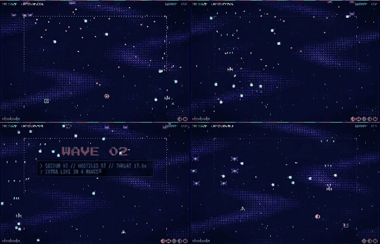

# Jev Strike — Julia 1 edition

A retro pixel space shooter built around one practical question: **how do you turn a fast, continuous game into a
small decision problem that a local model can solve quickly enough to fly the ship?**

In this edition the pilot is [SupersonicLabs/Julia-1](https://huggingface.co/SupersonicLabs/Julia-1), a
144M-parameter decision model, served locally through a `/v1/systemone` REST API. Every decision (where to move,
whether to fire, whether to bomb) comes from the model. The game reports facts and executes; it never picks a
move for the model or rescues a bad one.

It's a fork of [`jev-spaceshooter-demo`](https://github.com/jstdlee/jev-spaceshooter-demo), which ran the same
game on a self-hosted 26B djev-spark endpoint. That repo stays untouched; this one is tuned for Julia 1.



## Demo videos

Real-time recordings, 1200×1200, autopilot only (no manual input). Each difficulty level sets all four threat
sliders to that fraction of their range. Recorded 2026-09-28, one run per level, 60-second cap:

| Level | Bullets · enemies · fast bullets · fast speed | Outcome | Video | Screenshot |
| --- | --- | --- | --- | --- |
| 1/3 | 3.25× · 2.75× · 35% · 2.3× | died at 57.6 s, score 1,992 | [MP4, 6.8 MB](docs/media/julia1/difficulty-1-3.mp4) | [PNG](docs/media/julia1/difficulty-1-3.png) |
| 1/2 | 4.5× · 3.5× · 50% · 3.0× | survived 60 s, score 3,260 | [MP4, 7.7 MB](docs/media/julia1/difficulty-1-2.mp4) | [PNG](docs/media/julia1/difficulty-1-2.png) |
| 3/4 | 6.25× · 4.75× · 75% · 3.9× | died at 41.8 s, score 1,052 | [MP4, 4.6 MB](docs/media/julia1/difficulty-3-4.mp4) | [PNG](docs/media/julia1/difficulty-3-4.png) |
| 4/4 | 8× · 6× · 100% · 4.8× | died at 32.1 s, score 1,068 | [MP4, 3.5 MB](docs/media/julia1/difficulty-4-4.mp4) | [PNG](docs/media/julia1/difficulty-4-4.png) |

These are single runs, not benchmarks: the 1/3 run dying while the 1/2 run survived shows how much one run varies.
Controlled numbers are under [Results](#results).

## Why Julia 1

| | Julia 1 (this repo) | djev-spark 26B (original repo) |
| --- | --- | --- |
| Model | 144M parameters, mmBERT-small encoder + decision head | DiffusionGemma 26B-A4B NVFP4 |
| Weights | 550 MiB FP32, Apache 2.0, open | large GPU model, patched vLLM runtime |
| Decision latency | about 25 ms per decision on the live dashboard; 65 ms median, 79 ms p95 in lockstep traces with all 22 option judgements | about 180–230 ms idle, 380–400 ms under load |
| Decisions per second | 15–40 | 4–5 |
| Runs on CPU | yes (about 115 ms per 3-question request) | no |
| Output | typed answers with full probabilities; nothing is generated, so nothing to parse | generated tokens mapped to choices |
| Invalid answers in our runs | 0 | occasional API failures in the historical footage |

What that buys in practice:

- **Reflexes.** A decision every few frames instead of every 12–14 frames. Fresh commands arrive before the forecast
  goes stale, which matters most in dense bullet fields.
- **Cheap to run.** It fits beside other workloads on one GPU, or runs on CPU; no model server stack beyond Python.
- **Inspectable.** Every answer carries per-option probabilities and per-option scores (`option_scores`), shown in
  the event-log detail view, so you can see *why* a move won.
- **Same interface.** Julia answers the same `choice` / `score` / `noul` request envelope as djev and Laya, so the
  bridge only needed Julia-specific wording, not a new protocol.

And its limits, which shaped this fork:

- **It compares options; it doesn't follow rules.** Instructions like "pick the lowest tier number" or "shoot if
  enemy_count > 0" are ignored.
- **Its native multi-option answer is dominated by option order.** Listing `{shoot, cease}` versus `{cease, shoot}`
  flips the answer at 0.99 confidence, so the API scores each option independently instead.
- **It reacts to words, not meaning.** "stationary" outscores "continues", and "collects weapon (power up)" reads as
  *negative*. Rewording can fix a specific bias, but the effect of a phrase flips sign between contexts.
- **It can't choose goals.** Asked to pick between "return to center", "collect the weapon" and "stay" from facts
  (numeric or plain-language), it scored at chance, so it rarely detours for pickups.

## The jev strategy: observe, forecast, label, decide, execute

The model never sees pixels or raw physics. The game turns each moment into a small, labelled choice:

```text
HTML game (60 Hz): positions, velocities; forecasts all nine moves for 500 ms
    │ POST /api/decision
    ▼
Go bridge: validate the observation, turn each forecast into a short factual label
    │ POST /v1/systemone — one request, three questions: path, fire, bomb
    ▼
julia-api → Julia 1: judge every option, return typed answers with probabilities
    │
    ▼
Bridge normalization → client freshness checks → game executes the command
    └──────────────────────── next observation ────────────────────────┘
```

| Component | Does | Never does |
| --- | --- | --- |
| HTML game | simulates and renders; forecasts each of the nine moves; executes accepted commands | ranks moves, vetoes a dangerous choice, or steers on its own in autopilot |
| Go bridge | validates, writes factual labels, calls the model, normalizes answers, keeps credentials server-side | chooses a winner or replaces an unsafe answer |
| Julia 1 | picks one of nine paths, shoot or cease, hold or detonate | runs physics or sees future spawns |
| Controller | checks run, sequence, response age and command expiry | decides which direction is safer |

**Forecasting is substantial preprocessing.** The model selects from engineered physical forecasts; it doesn't
discover collision geometry itself. This demonstrates structured model decisions over those facts, not end-to-end
visual intelligence.

All nine moves are always offered, even deadly ones. A valid but wrong choice is executed. Missing, invalid or stale
answers produce a neutral hold-and-cease, a protocol rule rather than an evasive manoeuvre.

### Labels

Each move becomes one line that leads with a safety tier and then lists facts:

```text
Tier 1 GOOD: 9/9 escapes, open gap, open space, keeps course, toward center.
Tier 3 RISKY: 6/9 escapes, grazing gap, near enemy, crowded.
Tier 6 DEADLY: a threat hits the ship in 125 ms.
```

| Tier | Meaning (computed from the forecast) |
| --- | --- |
| 6 DEADLY | the move's own 500 ms lease, after the expected API wait, contacts a threat |
| 5 DOOMED | the move is clear, but none of the nine follow-up moves is |
| 4 TRAP | ends within 25 px of a wall |
| 3 RISKY | fewer than 2 clear follow-ups, or the best continuation grazes a bullet (< 15 px) |
| 2 OK | at least 2 clear follow-ups and at least a tight (≥ 15 px) gap |
| 1 GOOD | at least 4 clear follow-ups, an open (≥ 40 px) gap, and ≥ 110 px from every enemy ship |

The remaining words are facts for choosing within a tier: clear follow-ups (`escapes`), the best continuation's gap,
`near enemy`, crowding at the endpoint, `near wall`, pickups (`collects …` / `toward …`), `toward center`, and
`keeps course` for the move that continues the executing command.

### How Julia is asked

- **Path.** The bridge sends the nine labels with two per-option judgements (`option_questions`): *"Is this the
  right answer?"* (good at choosing among safe moves) and the score *"What happens to the ship?"* (destroyed →
  trapped → survives with difficulty → completely safe). The API adds them with weights 1 and 3. The first judgement
  alone ranks bad moves backwards (DEADLY above RISKY), which killed the ship in dense moments; the outcome score
  keeps danger in order. Weights were tuned offline on recorded states and checked on a holdout: 100% deadly-move
  avoidance in crisis states, about 80% best-tier picks overall.
- **Labels tuned for Julia.** Motion is stated only as `keeps course`. The other motion words (turns, reverses,
  stationary) weighed as much as safety and caused jitter.
- **Fire and bomb** are two-option choices scored the same independent way.
- **Why independent scoring.** Each option is judged on its own text, so order can't bias the answer. The cost is
  latency (22 judgements per decision) and ignoring the shared `state`, which works only because every label is
  self-describing.

## Results

Lockstep simulation (game time pauses while a decision is in flight; answers apply 30 ms after the observation),
8 seeds × 60 s:

| Upstream | dense-mid-speed | hardest | A→B→A flicker |
| --- | --- | --- | --- |
| Oracle (reads the labels perfectly; upper bound) | 60.0 s, 8/8 full, 0 hits | 60.0 s, 8/8 full, 0 hits | 3.8% |
| Julia 1, native multi-option choice | 11.2 s, 0/8 | 8.3 s, 0/8 | 14% |
| Julia 1, one judgement per option | 47.7 s, 3/8 | 43.1 s, 2/8 | 17% |
| **Julia 1, two judgements + Julia-tuned labels** | **60.0 s, 8/8, 4 hits** | **58.5 s, 7/8, 6 hits** | **7.8%** |

`hardest` = 4× bullets, 3× enemies, 85% fast bullets at 2.4×; `dense-mid-speed` is the same at 1.7×. The oracle
row shows the labels carry enough information; the remaining gap is the model's.

The original djev-spark edition reported 5/6 full runs at a 120 s cap in its own lockstep setup (220 ms latency,
older engine); the setups differ, so the numbers aren't directly comparable.

## Game mechanics

- **Pickups** float through the lower play area and fade over the last 2 s of a 14 s life: **B** bomb charge,
  **W** weapon upgrade, **F** escort jet. They are collected by flying into them; the move labels say
  `collects …` or `toward …`, and the model decides whether to go.
- **Weapon levels** (W pickups, up to level 3): the gun fires 1, 3, 5, 5 spread shots, missile salvos grow
  1, 2, 3, 3, and the missile cap rises from 4 to 6.
- **Homing missiles** launch automatically while the model's fire answer is `shoot`, steer toward a predicted
  intercept, and re-target when their target dies.
- **Escort jets** (up to 8) ring the ship, each facing its own direction, and fire outward with every volley while
  the ring orbits; their shots also destroy enemy bullets. A hit on the ship costs one jet; with no bombs left, a
  detonate decision sacrifices a jet for the same blast.
- **Bombs** start at 3 charges (max 6). A detonation destroys every enemy bullet and ship within 200 px; the boss
  takes 20 damage instead. The model decides when, from ranked hold/detonate labels.
- **Boss**: 40–60 s into a run, then 35–55 s after each boss dies, a 45-HP boss fires rotating rings, aimed fans
  and homing missiles.
- **Extra lives** every tenth wave, up to 5. Wave changes clear nothing.

## Controls

The run starts on autopilot, with Julia flying.

| Input | Action |
| --- | --- |
| Arrow keys / WASD | fly manually (takes over from the autopilot) |
| Space | pause / resume |
| **Auto pilot** button | switch between Julia and manual flight |
| **Restart run** button | start a new run |
| Threat level sliders | change bullet density, enemy density, fast-bullet share and speed |

Manual input, pausing, restarting or changing difficulty marks the run as not benchmark-qualified.

## Run locally

Requirements: a modern browser, Go 1.22+ for the bridge, Node.js 22 for the offline tests, and a `/v1/systemone`
server that supports `option_questions`. The Julia API used here (`julia-api`, a Go port of the Laya API with a
Python worker holding Julia 1) is a separate local project and is **not included** in this repository.

```bash
# 1. Julia API on :8011 with independent choice scoring
cd path/to/julia
JULIA_CHOICE_MODE=independent api/julia-api --host 127.0.0.1 --port 8011 --worker-socket /tmp/julia-api.sock --device cuda

# 2. This bridge on :7866
git clone https://github.com/jstdlee/jev-spaceshooter-demo-julia1.git
cd jev-spaceshooter-demo-julia1
cp .env.example .env   # set DJEV_URL=http://127.0.0.1:8011 and DJEV_MODEL=julia-1
go run ./demo/bridge --host 127.0.0.1 --port 7866
```

Open http://127.0.0.1:7866/. Keep the bridge on loopback; the browser never sees the upstream API key.

### Event-log detail view

Rows tagged `djev` or `rejected` in the event log are clickable (›). Each opens the exact `POST /v1/systemone`
request and the raw response, pretty-printed side by side with status, latency and decision id. The bridge keeps the
last 256 exchanges in memory (`GET /api/exchange?run_id=…&sequence=N`); every run's full trace is in
`demo/runs/<run_id>/events.jsonl` (gitignored).

### Retro UI

The unchanged 960×620 arena is rendered into a 480×310 pixel buffer and scaled up with hard pixels, with an
original pixel-art starfighter, a 16-colour palette, CRT scanlines and a cockpit console. On desktop the whole UI
scales to fit one screen (a square 1200×1200 frame or a wide layout, whichever gives the larger canvas); at 760 px
and below it becomes a single scrolling column for phones.

## Tests and simulation

```bash
node demo/test_space_shooter_logic.cjs
node demo/test_benchmark.cjs
node demo/test_strategy_regression.cjs   # needs Go on PATH
go test ./demo/bridge/
```

These check software behaviour, not tactical quality. To measure tactics without the browser:

```bash
go run ./demo/bridge --port 7870 --upstream oracle --runs-dir /tmp/sim-runs   # label ceiling, no model
go run ./demo/bridge --port 7871 --runs-dir /tmp/sim-runs                     # the real model
node demo/lockstep_sim.cjs --url http://127.0.0.1:7871 --seeds 1-8 --profile hardest --latency-ms 30
```

Run one simulation at a time against a local model: concurrent runs share inference capacity and skew results.

## Difficulty: why "just dodge" is not enough

| Setting | Browser default | `dense-mid-speed` | `hardest` | slider max |
| --- | ---: | ---: | ---: | ---: |
| Bullet density | 1× | 4× | 4× | 8× |
| Enemy density | 1× | 3× | 3× | 6× |
| Fast-bullet proportion | 0% | 85% | 85% | 100% |
| Fast-bullet speed | 1.6× | 1.7× | 2.4× | 4.8× |

Several objectives compete: immediate safety against room for the next move (a wide gap at the edge becomes a trap),
recovering toward the center against crossing a stream, prediction against latency, and shooting against positioning.
The ship is 20×18 px, starts with three lives, and moves at 112 px/s under model control.

## What we learned

- **Designing the decision problem is much of the work.** Observations, horizons, action granularity and label
  wording decided more than model choice. No weights were trained; the work shaped the questions around a fixed model.
- **Validity is not competence.** A perfectly formatted, high-confidence answer can still steer into danger; this
  demo executes it rather than silently rescuing it.
- **Small models need questions they can answer.** Julia 1 was fast and reliable once each option was judged on its
  own and the labels used words it reads the right way round; asking it to apply rules, compare numbers or pick goals
  failed.
- **Measure against a ceiling.** The oracle upstream shows whether a failure comes from missing information or from
  the model. Tune on recorded states, confirm on a holdout, then on seeds, one run at a time.

The full design history of the djev-spark edition, including its tier design experiments and live results, is in the
[original repository](https://github.com/jstdlee/jev-spaceshooter-demo#readme).
